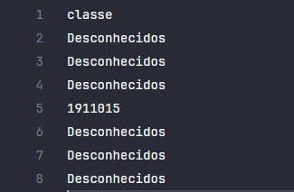
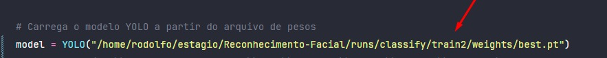

# Reconhecimento Facial

### Como clonar o projeto?

- git clone https://github.com/LuisFelipeA/Reconhecimento-Facial

Após clonar abra o diretório que foi gerado

## Dependencias
Para que a aplicação possa funcionar instale primeiro as dependências do projeto. Basta abrir a sua CLI no diretório gerado ao clonar o projeto e utilize os seguintes comandos:

- pip install ultralytics
- pip install opencv-python
- pip install mediapipe

***OBS¹:*** Não recomendamos o uso da última versão do python **(3.12.1)**, pois tivemos alguns problemas para instalar as dependencias. Pode ser usada a versão **(3.10.12)** ou **(3.11.5)**. Pode funcionar em outras versões também.

***OBS²:*** Se durante a execução de algum dos processos a seguir erros referentes a caminhos/*paths* forem retornados, recomendamos que substitua os seguintes trechos de código que especificam à aplicação paths relativos de determinados arquivos para os paths absolutos em seu sistema:

 Arquivo: evaluation.py
```python 
7
8   model = YOLO("../Reconhecimento-Facial/runs/classify/train2/weights/best.pt")
9
```
```python 
49
50   root_folder = "../Reconhecimento-Facial/FotosTiradas"
51
```

Arquivo: ReconhecimentoFacial.py
```python 
7
8    folderPath = "../Reconhecimento-Facial/FotosTiradas"
9   
```

## Como executar a aplicação?

O repositório já está treinado, então você pode executar o arquivo `ReconhecimentoFacial.py` que abrirá sua **webcam** e irá capturar algumas fotos suas.

Para interromper a câmera e finalizar as capturas pressione a tecla `Esc` ou utilize o comando `Ctrl + C` no terminal onde o processo da câmera está sendo executado.

Então a aplicação irá salvar as fotos na pasta `FotosTiradas`. 

Agora voce pode executar o arquivo `evaluation.py` que irá comparar as fotos com o nosso modelo. Ao fim do processo será criado um arquivo chamado `output_results.csv`, nele estão os resultados das comparações, se o rosto for desconhecido ele será exibido nos resultados como o `RA` da pessoa reconhecida do contrário ele estará como `Desconhecido`.

**Exemplo do resultado de um dos testes**


Neste caso, houveram rostos categorizados como desconhecidos e outro foi reconhecido e retornou o RA 1911015

## Como treinar um novo modelo?

### Datasets:
Para treinar um novo modelo é necessário criar uma pasta chamada **DataSet** dentro do diretório **yoloclassification** passando as imagens que você quer utilizar para treinar o modelo. 
Temos um arquivo **Dataset.txt** liks para acessar dois datasets para caso preferir adiantar o processo.

Altere o path para o seu dataset no aquivo yoloClassificador
Arquivo: yoloClassificador.py
```python 
6
7    model.train(data='../estagio/yoloclassification/dataset', epochs=10, imgsz=128)   
```

### Treinamento:
Agora você pode executar o arquivo `yoloclassificador.py` que irá treinar seu novo modelo utilizando as imagens fornecidas em seu dataset. Após treinado um novo diretório chamado **train** será criado. 

Caso já exista um diretório **train** o novo criado terá um anumeração em seu nome (ex: `train3`), basta ir então até o arquivo `evaluation.py` e alterar o seguinte trecho do caminho para o diretório: 



No caso do nosso exemplo trocaríamos o `/train2` por `/train3`
